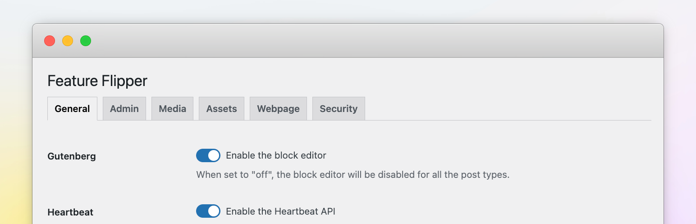

# 🚥 Feature Flipper

    

> [!NOTE]  
> This plugin serves as a showcase for [Howdy](https://github.com/syntatis/howdy), a starter kit for develping a WordPress® plugin that encourages modern development practices, and provides pre-configured tools for a more streamlined development experience.

WordPress® is packed with features—some are essential, while others you might not need.

This plugin gives you the ability to easily manage these features like Comments, the Block Editor (Gutenberg), Emojis, Automatic Updates, Post Embeds, XML-RPC, REST API, and more. If you don't need them, you can easily toggle them off.

It also includes some handy utilities like showing your site's environment type in the admin bar, enabling maintenance or private mode, or using random URLs for media pages.

## Features

This plugin organizes these settings into sections so you can quickly find and manage what you need:

### General

Tweak key WordPress® features to fit your needs:

* **Block Editor**: Prefer the Classic Editor? Disable the Block Editor for all or specific post types.
* **Block-based Widgets**: Turn off the Block Widgets Editor.
* **Comments**: Disable comments and remove related admin area elements.
* **Revisions**: Limit or disable post revisions to improve performance.
* **Embed**: Stop other sites from embedding your content.
* **Self-ping**: Prevent pingbacks to your own site.
* **Feeds**: Disable RSS feeds if you don’t need them.

### Admin

Customize your admin experience:

* **Dashboard Widgets**: Remove unwanted or all dashboard widgets.
* **Footer Text**: Get rid of the <q>Thank you for creating with WordPress</q> footer text.
* **Update Nags**: Hide update notices for WordPress, plugins, and themes.
* **Admin Bar**: Remove the admin bar on your site’s front end.
* **Howdy Text**: Replace the <q>Howdy</q> greeting in the admin bar.
* **Environment Type**: Display site's environment type (e.g. Development, Staging, Production) in the admin bar.

### Media

Adjust media-related settings:

* **Attachment Pages**: Disable attachment pages or re-enable them on WordPress 6.4+.
* **Attachment Slug**: Use random URLs for media pages to avoid slug conflicts.
* **Infinite Scroll**: Restore infinite scroll in the Media Library.
* **Image Quality**: Adjust the quality of uploaded images (JPEG only).

### Site

Control access and assets on your site:

* **Access**: Make your site public, restrict it to logged-in users, or enable maintenance mode.

#### Assets

* **Emojis**: Improve performance by removing emoji scripts and styles.
* **Script Version**: Remove version query strings from scripts and styles URLs.
* **jQuery Migrate**: Disable jQuery Migrate if it’s not needed.

#### Metadata

* **RSD Link**: Remove the Really Simple Discovery (RSD) tag.
* **Generator Meta Tag**: Hide the WordPress® version meta tag.
* **Shortlink**: Remove the shortlink meta tag.

### Security

Improve your site's security by disabling or limiting access to certain features:

* **File Edit**: Disable the built-in file editor for themes and plugins.
* **XML-RPC**: Disable the XML-RPC endpoint.
* **API Authentication**: Require authentication for all REST API requests.

#### Login

Apply additional security measures to your login page:

* **Identifier**: Restrict login to username only, email only, or allow both.
* **Obfuscate Error**: Prevent hints about which login credential is incorrect.
* **Block Bots**: Block known bots from accessing the login page.

#### Passwords

* **Application Passwords**: Disable Application Passwords and remove related UI elements.

### Advanced

For advanced users—configure these features carefully:

* **Updates**: Enable or disable updates for WordPress, plugins, and themes.
* **Cron**: Disable WP-Cron and use a real cron job.
* **Heartbeat**: Adjust or disable the Heartbeat API to reduce resource usage.

## Installation

### Installation from within WordPress

1. Visit **Plugins > Add New**.
2. Search for **Feature Flipper**.
3. Install and activate the **Feature Flipper** plugin.

### Manual upload

1. Upload the entire `syntatis-feature-flipper` folder to the `/wp-content/plugins/` directory.
2. Visit **Plugins**.
3. Activate the **Feature Flipper** plugin.

Learn more [about installing plugins](https://wordpress.org/documentation/article/manage-plugins/#installing-plugins).

## Frequently Asked Questions

	
Is this plugin compatible with WordPress Multisite?

	
	Not yet, but it's on the plan!

## Contributing

Have an idea, suggestion, or found a bug? Open an issue or submit a pull request. For more details on how to contribute, check out the [CONTRIBUTING.md](CONTRIBUTING.md) file.
